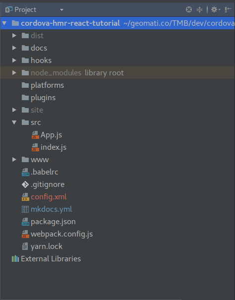
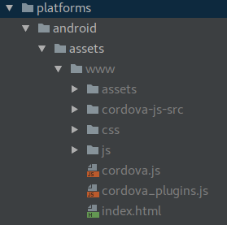
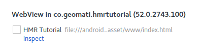
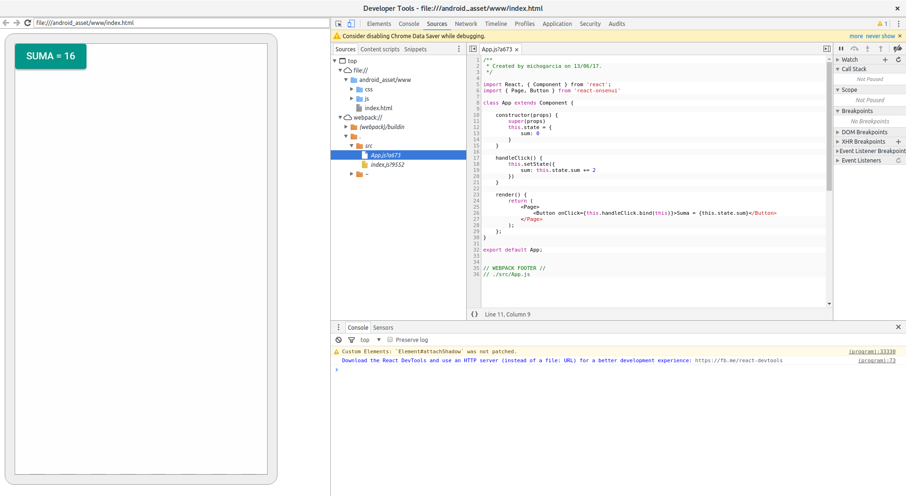

# Añadiendo Cordova al stack

Seguiremos adelante añadiendo Cordova al stack de herramientas. Teniendo instalado [`cordova-cli`](https://cordova.apache.org/docs/en/latest/guide/cli/)
crearemos un proyecto:
    
    cordova create hmrtutorial co.geomati.hmrtutorial HmrTutorial
    
Crearemos el proyecto fuera de nuestra carpeta de raiz, ya que de otra manera la `cordova-cli` dará un error. Después moveremos
la estructura del proyecto `cordova` creado a nuestro raíz, quedando de la siguiente manera:

Atendiendo un poco a como funciona `cordova`, deberemos modificar ligeramente la estructura de nuestro proyecto para adecuarnos 
a esta tecnología. Un proyecto `cordova` dispone de una carpeta `www` donde se encuentra lo que será la aplicación que acabe
mostrandose en la `webView`. `cordova` durante el proceso de `build` copia el contenido de la carpeta `www` a la carpeta
`<platform>/assets/www` de la plataforma que estemos construyendo. Teniendo esto en cuenta, deberemos apuntar la salida de nuestro
`webpack` a la carpeta `www` eliminando la carpeta `dist`.

Eliminaremos **todo** el contenido de la carpeta `www` generado por `cordova`, y moveremos el `dist/index.html` a la carpeta
 `www`. Ahora modificaremos el `webpack.config.js` para que la salida apunte a esta carpeta `www`:
 
     output: {
         path: path.resolve(__dirname, 'www/js'),
         filename: '[name].js',
         publicPath: "/js/"
     },
     
     ...
     
    devServer: {
        contentBase: path.join(__dirname, "www"),
        hot: true, // Tell the dev-server we're using HMR,
        compress: true,
        port: 3000,
        publicPath: "/js/"
    },
    
Para probar de nuevo nuestra `App` pero esta vez en entorno móvil, primero deberemos añadir una [`platform`](https://cordova.apache.org/docs/en/latest/guide/cli/#add-platforms)
Añadiremos la plataforma de Android:

    $ cordova platform add android

Tras esto, veremos que se ha añadido contenido a la carpeta `platforms`. Si navegamos por el directorio `platforms/android/assets/www`
veremos que se ha replicado el contenido de nuestra carpeta `www` y además aparecen varios archivos y directorios que necesita
`cordova`.

Si arrancamos la aplicación en un terminal:

    $ cordova run android
    
Tendremos nuestra `App` en el terminal:
    

    
Si queremos debugar nuestra `App` corriendo en el terminal, utilizaremos las herramientas de desarrollo de Chrome. Navegamos a
la url [chrome://inspect](chrome://inspect) y veremos que aparece nuestra `WebView`:

si pulsamos sobre `inspect` podremos ver la consola de desarrollo para nuestra `App` cargada en el terminal

¿Qué pasa si ahora modificamos el texto de nuestro botón?. Veremos que no sucede nada en el terminal, ya que lo que estamos
viendo es una versión "construida" de lo que existe en nuestra carpeta `www`, ya que en el `build` de `cordova` se copia 
el contenido a la carpeta de la plataforma y se empaqueta en el archivo que será instalado en el terminal. 

Desde el inspect podremos debugar sobre el código fuente de nuestra `App`, pero cada cambio deberá ser primero compilado
por `webpack`:

    $ npm run build
    
y luego construido e instalado en el terminal:
    
    $ cordova run android
    
algo que puede ser sumamente tedioso en función del tamaño de nuestra app.
    
Pero, ¿no podemos desarrollar en web, donde tenemos las herramientas de desarrollo habituales y luego empaquetar para usar en el 
terminal?, si, en muchas casos esa es la estrategia a utilizar, pero cuando empezamos a hacer uso de `plugins` de `cordova`
nos surge el problema de que necesitaremos emuladores de esos plugins en entorno `web`, y en muchos casos estos no existen o 
estás desactualizados.

Hasta ahora lo más funcional es [`Cordova-Simulate`](https://github.com/Microsoft/cordova-simulate) que simula un entorno 
`cordova` en la web.