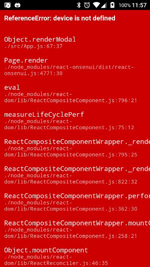
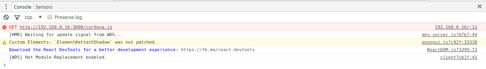
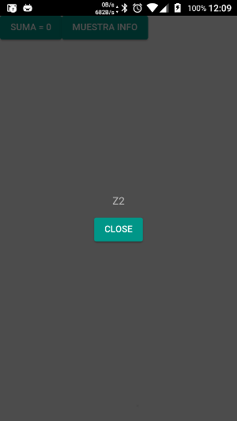

# HMR en Cordova

El objetivo ahora es poder utilizar HRM y `react-hot-loader` pero con la `App` corriendo en el terminal, y así poder acceder
a una funcionalidad de los plugins en entorno real. 

Si recordamos de la instalación anterior, arrancando `webpack-dev-server` tendremos un entorno servidor web con nuestra 
`App` corriendo y con las herramientas anteriores configuradas. Podremos acceder a esta desde la url [http://localhost:3000/](http://localhost:3000/)

`cordova` levanta una `WebView` sobre la que lanza el archivo `index.html` que está en la carpeta `platforms/android/assets/www`. 
Si vamos hasta el código de la plataforma que ha creado `cordova`, navegando hasta `platforms/android/src/co/hmrtutorial/` 
veremos la `MainActivity.java` donde se encuentra el código que lanza la `WebView`:

    public class MainActivity extends CordovaActivity
    {
        @Override
        public void onCreate(Bundle savedInstanceState)
        {
            super.onCreate(savedInstanceState);
    
            // enable Cordova apps to be started in the background
            Bundle extras = getIntent().getExtras();
            if (extras != null && extras.getBoolean("cdvStartInBackground", false)) {
                moveTaskToBack(true);
            }
    
            // Set by <content src="index.html" /> in config.xml
            loadUrl(launchUrl);
        }
    }
    
El método `loadUrl(launchUrl)` es el que abre el `index.html`, y como se indica en el mismo código, se configura modificando
el `config.xml`, el archivo que crea `cordova` para definir las propiedades de la aplicación.
 
Si navegamos hasta ese archivo veremos que como se indica en el código, nuestra `App` está apuntando al `index.html`, que será
el que se encuentra en la carpeta `platforms/assets/www/`:
 
    <content src="index.html" />
        
Podremos modificar ese `content` para que apunte a la url de nuestro servidor. Para ello deberemos tener el `webpack-dev-server`
configurado para que se pueda ver desde IP's que pertenezcan a nuestra misma red, añadiendole `--host 0.0.0.0` al arrancar:
        
    "dev": "webpack-dev-server --host 0.0.0.0",
    
Buscaremos la IP de red de nuestro equipo y añadiremos esta IP junto con el puerto, de la manera `http://<ip>:<puerto>` al `content` de nuestro `config.xml`:
    
    <content src="http://192.168.0.16:3000" />
    
Ahora arrancaremos de nuevo nuestra `App` en el terminal, y:

Para solucionar este problema deberemos [añadir una nueva propiedad](https://github.com/webpack/webpack-dev-server/issues/882) 
a nuestro `webpack-dev-server`:

    disableHostCheck: true,

Ahora tendremos corriendo nuestra `App` dentro del terminal HMR y `react-hot-loader` pero, ¿qué pasa con `cordova`?.
Para comprobar que pasa con `cordova` añadiremos un plugin a nuestra `App`, por ejemplo el  [`device`](https://cordova.apache.org/docs/en/latest/reference/cordova-plugin-device/) 
que nos permite acceder a la información del terminal sobre el que corre nuestra `App`. Para ello:

    $ cordova plugin add cordova-plugin-device --save
    
Añadiremos la funcionalidad que hace uso del plugin:
    
    class App extends Component {
    
        constructor(props) {
            super(props)
            this.state = {
                sum: 0,
                isOpen: false
            }
        }
    
        handleClick() {
            this.setState({
                sum: this.state.sum += 2
            })
        }
    
        handleInfo() {
            this.setState({
                isOpen: true
            })
        }
    
        render() {
            return (
                <Page renderModal={() => (<Modal isOpen={this.state.isOpen}>
                    <section style={{margin: '16px'}}>
                        

                            { device.model }
                        

                        

                            <Button onClick={() => this.setState({isOpen: false})}>
                                Close
                            </Button>
                        

                    </section>
                </Modal>)}>
                    <Button onClick={this.handleClick.bind(this)}>Suma = {this.state.sum}</Button>
                    <Button onClick={this.handleInfo.bind(this)}>Muestra info</Button>
                </Page>
            );
        };
    }
    
    export default App;
    
Y al actualizar la `App` en el terminal, nos dará un error:
    

   
`cordova` crea los plugins como objetos globales, por lo que la linea:
    
    { device.model }
    
está generando un error `ReferenceError: device is not defined`, ya que nuestra `App` no está haciendo uso de la funcionlidad 
de `cordova` sino que simplemente estś siendo mostrada embebida un `WebView` dentro de nuestro terminal.

Si comparamos el `index.html` generado por `cordova` comparado con el que hemos ido generando nosotros, veremos que nos
falta una referencia a `cordova.js` que es la librería que da acceso a la funcionalidad de `cordova`. Si incluimos este archivo 
en nuestro `index.html`:

    
    
obtendremos un error:
    

    
Esto es porque ese archivo se ha creado en la carpeta de la `platform` ya que es diferente para cada plataforma. Podremos 
copiar el archivo y los demás archivos que necesita nuestra `App` de `cordova` a la carpeta `www` o podemos apuntar el `contentBase`
de nuestro `webpack-dev-server` para que sirva los contenidos de la carpeta donde se encuentra ese archivo. Modificaremos 
en el `webpack.config.js`:

    output: {
        path: path.resolve(__dirname, 'platforms/android/assets/www/js'),
        filename: '[name].js',
        publicPath: "/js/"
    },
        
    ...
            
    devServer: {
        contentBase: path.join(__dirname, "platforms/android/assets/www"),
        hot: true, // Tell the dev-server we're using HMR,
        compress: true,
        port: 3000,
        publicPath: "/js/",
        disableHostCheck: true,
    },
                
Ahora tendremos que la salida de nuestro `webpack` se servirá directamente desde la carpeta de la plataforma, por lo que no será
necesario realizar un `build` de la misma.

Y si realizamos la comprobación anterior, veremos que ahora si accede a los plugins:

