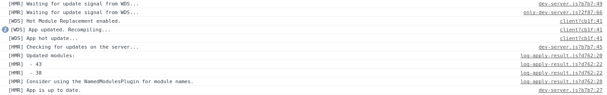
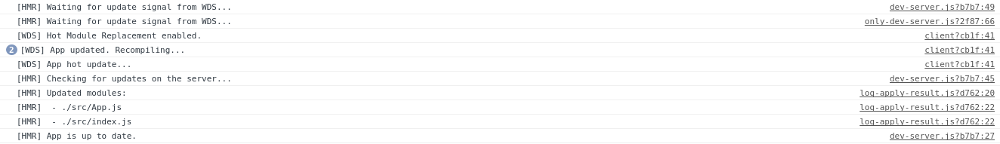

# Configurando Hot Module Replacement
[Hot Module Replacement](https://webpack.js.org/concepts/hot-module-replacement), HMR, permite intercambiar, añadir o eliminar módulos sin necesidad de hacer una recarga completa de
la aplicación.

Comenzaremos configurando HMR modificando el `webpack.config.js` para incluir estos cambios.

Incluiremos el `plugin` de HMR:

    plugins: [
        new webpack.HotModuleReplacementPlugin() // Enable HMR
      ],

los plugins permiten modificar el comportamiento de `webpack` añadiendole nuevas funcionalidades.
      
Ahora le diremos al `webpack-dev-server` que utilice HMR:

    devServer: {
        contentBase: path.join(__dirname, "dist"),
        hot: true, // Tell the dev-server we're using HMR
        compress: true,
        port: 3000,
        publicPath: '/js/'
    },
    
Añadiremos la propiedad `publicPath` también al `output`:

    output: {
        path: path.resolve(__dirname, 'dist/js'),
        filename: '[name].js',
        publicPath: "/js/"
    },
    
Como se [explica en la documentación](https://webpack.js.org/concepts/hot-module-replacement/#in-a-module) hemos de indicar 
en nuestros módulos que hagan uso de HMR. Esto lo podemos hacer a nivel de módulo o directamente en el módulo
raiz que hará que HMR lo use todo el arbol de módulos. Para ello añadiremos a nuestro archivo `index.js` el código necesario para 
hacer uso de HMR:

    if (module.hot) {
        module.hot.accept();
    }

Si ahora realizamos un cambio en `App.js` veremos que se aplican estos sin recargar toda la página. Podremos ver la salida 
en la consola de desarrollo:

Como podemos observar, los nombres de los archivos que han cambiado no aparecen. Para evitar esto, añadiremos un plugin a la 
configuración actual de `webpack`

    plugins: [
        new webpack.HotModuleReplacementPlugin(), // Enable HMR
        new webpack.NamedModulesPlugin(),
    ],
    

## Referencias
[Webpack & The Hot Module Replacement](https://medium.com/@rajaraodv/webpack-hot-module-replacement-hmr-e756a726a07)