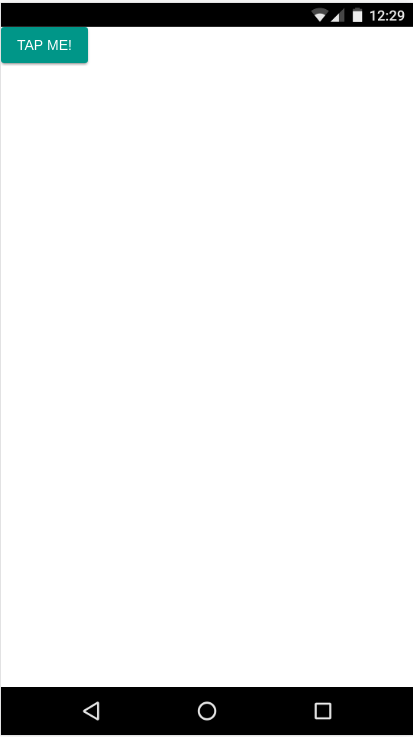
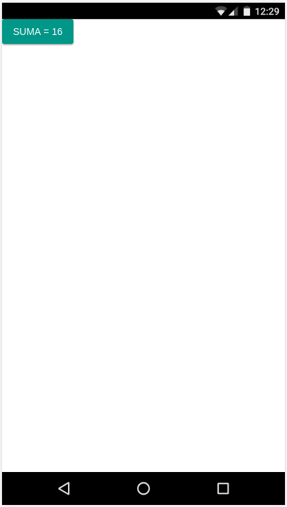
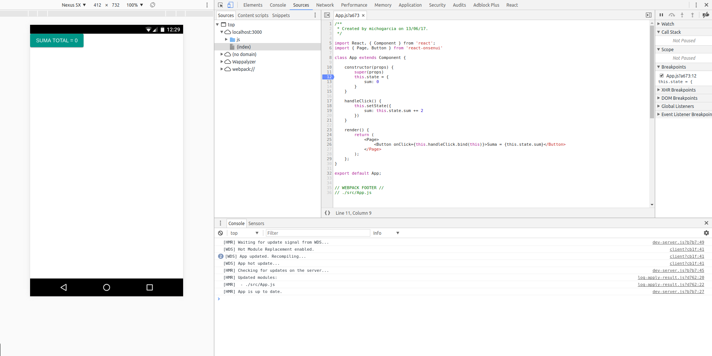

# OnsenUI, React, babel-preset-react y react-hot-loader

El objetivo de este tutorial es configurar un stack de herramientas para desarrollar aplicaciones móvil híbridas, 
y para ello utilizaremos el framework [OnsenUI con React](https://onsen.io/react/). Este framework dispone de herramientas
de construcción del proyecto, [Monaca](https://monaca.io/cli.html) pero realizaremos nuestra propia configuración para poder
tener control sobre el entorno de desarrollo y comprender todos los pasos de la configuración de nuestro propio `webpack`.

## OnsenUI

Lo primero que haremos será instalar y configurar nuestra plantilla básica con Onsen.

    yarn add onsenui react-onsenui react react-dom

así tendremos todas las librerías necesarias para seguir adelante. Ahora modificaremos el nuestra aplicación para que utilice 
este framework. Para ello crearemos una `App.js` de OnsenUI:

    import React, { Component } from 'react';
    import { Page, Button } from 'react-onsenui'
    
    class App extends Component {
    
        render() {
            return (
                <Page>
                    <Button onClick={this.handleClick}>Tap me!</Button>
                </Page>
            );
        };
    }
    
    export default App;
    
y modificaremos nuestro `index.js` para utilizar nuestra nueva `App.js`:

    import React from 'react';
    import ReactDOM from 'react-dom';
    import App from './App';
    
    const rootElement = document.getElementById('app');
    
    const render = Component =>
        ReactDOM.render(
            <AppContainer>
                <Component />
            </AppContainer>,
            rootElement
        );
    
    render(App);
    
    if (module.hot) {
        module.hot.accept('./App', () => render(App));
    }
    
Al arrancar nuestro `webpack-dev-server` obtendremos un error:
    
    > webpack-dev-server --host 0.0.0.0
    
    Project is running at http://0.0.0.0:3000/
    webpack output is served from /js/
    Content not from webpack is served from /home/michogarcia/geomati.co/TMB/dev/cordova-hmr-react-tutorial/dist
    Hash: c0697a3b40373c8d8f34
    Version: webpack 2.6.1
    Time: 1127ms
      Asset    Size  Chunks                    Chunk Names
    main.js  901 kB       0  [emitted]  [big]  main
    chunk    {0} main.js (main) 305 kB [entry] [rendered]
     [./node_modules/ansi-regex/index.js] ./~/ansi-regex/index.js 135 bytes {0} [built]
     [./node_modules/events/events.js] ./~/events/events.js 8.33 kB {0} [built]
     [./node_modules/html-entities/index.js] ./~/html-entities/index.js 231 bytes {0} [built]
     [./node_modules/punycode/punycode.js] ./~/punycode/punycode.js 14.7 kB {0} [built]
     [./node_modules/strip-ansi/index.js] ./~/strip-ansi/index.js 161 bytes {0} [built]
     [./node_modules/url/url.js] ./~/url/url.js 23.3 kB {0} [built]
     [./node_modules/url/util.js] ./~/url/util.js 314 bytes {0} [built]
     [./node_modules/webpack-dev-server/client/index.js?http:/0.0.0.0:3000] (webpack)-dev-server/client?http://0.0.0.0:3000 5.68 kB {0} [built]
     [./node_modules/webpack-dev-server/client/overlay.js] (webpack)-dev-server/client/overlay.js 3.73 kB {0} [built]
     [./node_modules/webpack-dev-server/client/socket.js] (webpack)-dev-server/client/socket.js 897 bytes {0} [built]
     [./node_modules/webpack/hot/dev-server.js] (webpack)/hot/dev-server.js 1.57 kB {0} [built]
     [./node_modules/webpack/hot/emitter.js] (webpack)/hot/emitter.js 77 bytes {0} [built]
        [0] multi (webpack)-dev-server/client?http://0.0.0.0:3000 webpack/hot/dev-server ./src/index.js 52 bytes {0} [built]
     [./node_modules/webpack/hot/log-apply-result.js] (webpack)/hot/log-apply-result.js 1.02 kB {0} [built]
     [./src/index.js] ./src/index.js 732 bytes {0} [built] [failed] [1 error]
         + 72 hidden modules
    
    ERROR in ./src/index.js
    Module build failed: SyntaxError: Unexpected token (13:12)
    
      11 | const render = Component =>
      12 |     ReactDOM.render(
    > 13 |             <Component />,
         |             ^
      14 |         rootElement
      15 |     );
      16 | 
    
     @ multi (webpack)-dev-server/client?http://0.0.0.0:3000 webpack/hot/dev-server ./src/index.js
    webpack: Failed to compile.
    
## babel-preset-react
      
 Esto es debido a que `webpack` no es capaz de compilar nuestra síntaxis de React. Para ello deberemos configurar un preset de Babel
 que sea capaz de compilar dicha síntaxis. [babel-preset-react](https://babeljs.io/docs/plugins/preset-react/) será el encargado de dicha tarea. 
 Primero la instalamos, y aprovechando, instalaremos el preset de `babel` para ES2015 que nos dará acceso a todos los plugins de ES6:
 
    yarn add babel-preset-react babel-preset-es2015 --dev

 Y configuramos `babel` para que use este preset. Crearemos un archivo `.babelrc` en el raiz de nuestro directorio y añadiremos:
 
     {
       "presets": [
         ["es2015", {"modules": false}],
         "react"
       ]
     }
 
 Ahora nuestra aplicación lucirá de la siguiente manera:
 
 
 
 ¿Qué pasa con los estilos?, ¿porqué no aparecen los botones?. Para ello deberemos cargar los CSS de OnsenUI que se encarga 
 de dar forma a los componentes.
 
 Para ello importaremos estos estilos desde nuestro `indes.js`:
     
     require('onsenui/css/onsen-css-components.css');
     require('onsenui/css/onsenui.css');
     
 Y de nuevo obtendremos un error:
 
     ERROR in ./~/onsenui/css/onsenui.css
     Module parse failed: /home/michogarcia/geomati.co/TMB/dev/cordova-hmr-react-tutorial/node_modules/onsenui/css/onsenui.css Unexpected character '@' (19:0)
     You may need an appropriate loader to handle this file type.
     |  */
     | 
     | @import url("ionicons/css/ionicons.min.css");
     | @import url("material-design-iconic-font/css/material-design-iconic-font.min.css");
     | @import url("font_awesome/css/font-awesome.min.css");
      @ ./src/index.js 10:0-34
      @ multi (webpack)-dev-server/client?http://0.0.0.0:3000 webpack/hot/dev-server ./src/index.js
      
 Esto es similar a lo sucedido con React, y es que tendremos que decirle a `webpack` el tipo de módulos que estamos intentando
 cargar. Para ello instalaremos los `loaders` necesarios:
  
    yarn add css-loader style-loader file-loader --dev
    
 y modificamos la configuración de nuestro `webpack.config.js` para que use estos loaders:
 
        module: {
            rules: [
                {
                    test: /\.(js|jsx)$/,
                    exclude: [/node_modules/],
                    use: ['babel-loader'],
                },
                {
                    test: /\.css$/,
                    use: [ 'style-loader', 'css-loader' ]
                },
                {
                    test: /\.(ttf|otf|eot|svg|woff(2)?)(\?[a-z0-9]+)?$/,
                    loader: 'file-loader?name=assets/[name].[ext]'
                }
            ],
        },
        
 
 
## react-hot-loader

Para probar `react-hot-loader` haremos unas pequeñas modificaciones en nuestra `App.js`. Añadiremos un estado a nuestro 
componente para poder probar la funcionalidad que aporta `react-hot-loader`, ya que lo que consigue es mantener el estado 
de nuestro componente a pesar de actualizar el módulo.

Como se puede observar en el código, hemos añadido un estado `sum` en el constructor del componente:
        
    constructor(props) {
        super(props)
        this.state = {
            sum: 0
        }
    }

Añadiremos el evento que se encargue de modificar el estado, en este caso un evento disparado desde el botón:

    handleClick() {
        this.setState({
            sum: this.state.sum += 2
        })
    }

y lo enlazamos al botón:

    render() {
        return (
            <Page>
                <Button onClick={this.handleClick.bind(this)}>Suma = {this.state.sum}</Button>
            </Page>
        );
    };
    
Ahora cada vez que pulsemos el botón modificará el texto del mismo:

Pero si tras haber pulsado y modificado el estado, cambiamos el texto del botón, HMR recargará nuestro botón y reiniciará 
el estado del componente cambiando el valor a su estado inicial.
  

Ahora es cuando entra en juego `react-hot-loader`, ya que este permitirá mantener el estado de nuestro componente tras la 
recarga del código mediante HMR.

Empezaremos instalando `react-hot-loader`:

    yarn add react-hot-loader@next --dev

modificaremos el `webpack.config.js` para activarlo:

    entry: [
        'react-hot-loader/patch',
        // activate HMR for React
        
        './src/index.js',
        // the entry point of our app
    ]

Por último debemos modificar nuestro punto de entrada para que utilice el `AppContainer` de `react-hot-loader` que será
el encargado de mantener el estado de nuestra aplicación. El componente raíz de la aplicación deberá estar contenido dentro
del componente `AppContainer`:

    const render = Component => {
        ReactDOM.render(
            <AppContainer>
                <Component />
            </AppContainer>,
            rootElement
        )
    }
    
    render(App)
    
    if (module.hot) {
        module.hot.accept('./App', () => { render(App) })
    }

De esta manera si realizamos el proceso anterior, modificando el estado de nuestro componente y a su vez modificamos el código
para que actue HMR, veremos como el estado del componente se mantiene tras la actualización.

## Referencias
 
[https://thesabbir.com/hot-reloading-react-stateless-components/](https://thesabbir.com/hot-reloading-react-stateless-components/)
 